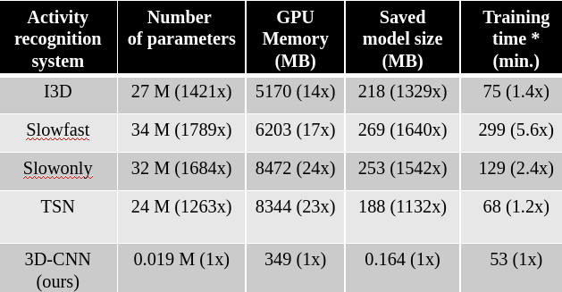
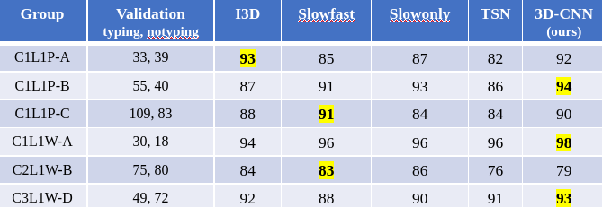
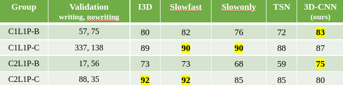

# Activity classifier

## [Depth study: Group split](./depth_study_3D_CNNs/depth_study_3D_CNNs.md)
We performed expriments to study the depth `d` that provides best activity
recognition resutls. A summary is provided below.

* **Best depth `d`**  
The best depth of our dyadic 3D-CNN is determined to be `d = 4`. Please refer
[depth_study_3D_CNNs.md](./depth_study_3D_CNNs/depth_study_3D_CNNs.md) for more information.

* **Dyadic 3D-CNNs vs SOTA:**  
The following table summarizes our optimal daydic 3D-CNN against
SOTA algorithms in activity recognition. We use *mmaction2* library.
The following tables are taken from my proposal defense.

