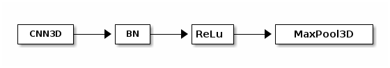

# Depth study
Studying depth of networks using group based splits
We use optimized dyadic 3D-CNN to recognize typing in the proposed regions. We used
saved check point to process typing proposals.

## Info

The following expriment uses group based leave one out to compare dyad depths.

## Architecture

-   One dyad

-   Kernel size: 3x3x3
-   Number of kernels: [4, 8, 16, 32]
-   MaxPool3D: 3x3x3 with stride 3.
-   Max depth: 4

## Dataset

-   [Group based leave one out dataset](../../dataset/trimmed_video_group_split.md)

## System info

-   CPU: Intel(R) Xeon(R) Silver 4208 CPU @ 2.10GHz
-   GPU: Quadro RTX 5000
    -   VRAM: 16 GB
    -   Tensor Cores: 384
    -   CUDA Parallel Processing cores: 3072
-   Memory: 128 GB

## Training parameters

-   Learning rate: 0.001
-   Momentum: 0.9
-   Max Epochs: 50

## Best model

Model producing highest validation accuracy is considered to be the best.

## Results

### typing/notyping

-   Interactive graphs
    -   [C1L1P-A](./tynty_C1L1P-A.html)
    -   [C1L1P-B](./tynty_C1L1P-B.html)
    -   [C1L1P-C](./tynty_C1L1P-C.html)
    -   [C1L1W-A](./tynty_C1L1W-A.html)
    -   [C2L1W-B](./tynty_C2L1W-B.html)
    -   [C3L1W-D](./tynty_C3L1W-D.html)

#### C1L1P-A,  [Interactive graph](./tynty_C1L1P-A.html)

<table border="2" cellspacing="0" cellpadding="6" rules="groups" frame="hsides">

<colgroup>
<col  class="org-right" />

<col  class="org-left" />

<col  class="org-right" />

<col  class="org-right" />

<col  class="org-right" />

<col  class="org-right" />
</colgroup>
<thead>
<tr>
<th scope="col" class="org-right">Dyads</th>
<th scope="col" class="org-left"># parameters</th>
<th scope="col" class="org-right">best epoch</th>
<th scope="col" class="org-right">trn acc</th>
<th scope="col" class="org-right">val acc</th>
<th scope="col" class="org-right">trn - val acc</th>
</tr>
</thead>

<tbody>
<tr>
<td class="org-right">2</td>
<td class="org-left">47,305</td>
<td class="org-right">13</td>
<td class="org-right">97</td>
<td class="org-right">90</td>
<td class="org-right">7%</td>
</tr>

<tr>
<td class="org-right">3</td>
<td class="org-left">7,801</td>
<td class="org-right">10</td>
<td class="org-right">90</td>
<td class="org-right">89</td>
<td class="org-right">1%</td>
</tr>

<tr>
<td class="org-right">4</td>
<td class="org-left">18,777</td>
<td class="org-right">15</td>
<td class="org-right">91</td>
<td class="org-right">92</td>
<td class="org-right">-1%</td>
</tr>
</tbody>
</table>

#### C1L1P-B, [Interactive graph](./tynty_C1L1P-B.html)

<table border="2" cellspacing="0" cellpadding="6" rules="groups" frame="hsides">

<colgroup>
<col  class="org-right" />

<col  class="org-left" />

<col  class="org-right" />

<col  class="org-right" />

<col  class="org-right" />

<col  class="org-right" />
</colgroup>
<thead>
<tr>
<th scope="col" class="org-right">Dyads</th>
<th scope="col" class="org-left"># parameters</th>
<th scope="col" class="org-right">best epoch</th>
<th scope="col" class="org-right">trn acc</th>
<th scope="col" class="org-right">val acc</th>
<th scope="col" class="org-right">trn - val acc</th>
</tr>
</thead>

<tbody>
<tr>
<td class="org-right">2</td>
<td class="org-left">47,305</td>
<td class="org-right">8</td>
<td class="org-right">95</td>
<td class="org-right">88</td>
<td class="org-right">7%</td>
</tr>

<tr>
<td class="org-right">3</td>
<td class="org-left">7,801</td>
<td class="org-right">29</td>
<td class="org-right">95</td>
<td class="org-right">95</td>
<td class="org-right">0%</td>
</tr>

<tr>
<td class="org-right">4</td>
<td class="org-left">18,777</td>
<td class="org-right">34</td>
<td class="org-right">93</td>
<td class="org-right">94</td>
<td class="org-right">-1%</td>
</tr>
</tbody>
</table>

#### C1L1P-C, [Interactive graph](./tynty_C1L1P-C.html)

<table border="2" cellspacing="0" cellpadding="6" rules="groups" frame="hsides">

<colgroup>
<col  class="org-right" />

<col  class="org-left" />

<col  class="org-right" />

<col  class="org-right" />

<col  class="org-right" />

<col  class="org-right" />
</colgroup>
<thead>
<tr>
<th scope="col" class="org-right">Dyads</th>
<th scope="col" class="org-left"># parameters</th>
<th scope="col" class="org-right">best epoch</th>
<th scope="col" class="org-right">trn acc</th>
<th scope="col" class="org-right">val acc</th>
<th scope="col" class="org-right">trn - val acc</th>
</tr>
</thead>

<tbody>
<tr>
<td class="org-right">2</td>
<td class="org-left">47,305</td>
<td class="org-right">1</td>
<td class="org-right">80</td>
<td class="org-right">85</td>
<td class="org-right">-5%</td>
</tr>

<tr>
<td class="org-right">3</td>
<td class="org-left">7,801</td>
<td class="org-right">23</td>
<td class="org-right">93</td>
<td class="org-right">86</td>
<td class="org-right">7%</td>
</tr>

<tr>
<td class="org-right">4</td>
<td class="org-left">18,777</td>
<td class="org-right">2</td>
<td class="org-right">83</td>
<td class="org-right">90</td>
<td class="org-right">-7%</td>
</tr>
</tbody>
</table>

#### C1L1W-A, [Interactive graph](./tynty_C1L1W-A.html)

<table border="2" cellspacing="0" cellpadding="6" rules="groups" frame="hsides">

<colgroup>
<col  class="org-right" />

<col  class="org-left" />

<col  class="org-right" />

<col  class="org-right" />

<col  class="org-right" />

<col  class="org-right" />
</colgroup>
<thead>
<tr>
<th scope="col" class="org-right">Dyads</th>
<th scope="col" class="org-left"># parameters</th>
<th scope="col" class="org-right">best epoch</th>
<th scope="col" class="org-right">trn acc</th>
<th scope="col" class="org-right">val acc</th>
<th scope="col" class="org-right">trn - val acc</th>
</tr>
</thead>

<tbody>
<tr>
<td class="org-right">2</td>
<td class="org-left">47,305</td>
<td class="org-right">38</td>
<td class="org-right">100</td>
<td class="org-right">92</td>
<td class="org-right">8%</td>
</tr>

<tr>
<td class="org-right">3</td>
<td class="org-left">7,801</td>
<td class="org-right">3</td>
<td class="org-right">86</td>
<td class="org-right">98</td>
<td class="org-right">-12%</td>
</tr>

<tr>
<td class="org-right">4</td>
<td class="org-left">18,777</td>
<td class="org-right">29</td>
<td class="org-right">93</td>
<td class="org-right">98</td>
<td class="org-right">-5%</td>
</tr>
</tbody>
</table>

#### C2L1W-B [Interactive graph](./tynty_C2L1W-B.html)

<table border="2" cellspacing="0" cellpadding="6" rules="groups" frame="hsides">

<colgroup>
<col  class="org-right" />

<col  class="org-left" />

<col  class="org-right" />

<col  class="org-right" />

<col  class="org-right" />

<col  class="org-right" />
</colgroup>
<thead>
<tr>
<th scope="col" class="org-right">Dyads</th>
<th scope="col" class="org-left"># parameters</th>
<th scope="col" class="org-right">best epoch</th>
<th scope="col" class="org-right">trn acc</th>
<th scope="col" class="org-right">val acc</th>
<th scope="col" class="org-right">trn - val acc</th>
</tr>
</thead>

<tbody>
<tr>
<td class="org-right">2</td>
<td class="org-left">47,305</td>
<td class="org-right">8</td>
<td class="org-right">81</td>
<td class="org-right">72</td>
<td class="org-right">9%</td>
</tr>

<tr>
<td class="org-right">3</td>
<td class="org-left">7,801</td>
<td class="org-right">12</td>
<td class="org-right">93</td>
<td class="org-right">74</td>
<td class="org-right">19%</td>
</tr>

<tr>
<td class="org-right">4</td>
<td class="org-left">18,777</td>
<td class="org-right">15</td>
<td class="org-right">91</td>
<td class="org-right">79</td>
<td class="org-right">12%</td>
</tr>
</tbody>
</table>

#### C3L1W-D [Interactive graph](./tynty_C3L1W-D.html)

<table border="2" cellspacing="0" cellpadding="6" rules="groups" frame="hsides">

<colgroup>
<col  class="org-right" />

<col  class="org-left" />

<col  class="org-right" />

<col  class="org-right" />

<col  class="org-right" />

<col  class="org-right" />
</colgroup>
<thead>
<tr>
<th scope="col" class="org-right">Dyads</th>
<th scope="col" class="org-left"># parameters</th>
<th scope="col" class="org-right">best epoch</th>
<th scope="col" class="org-right">trn acc</th>
<th scope="col" class="org-right">val acc</th>
<th scope="col" class="org-right">trn - val acc</th>
</tr>
</thead>

<tbody>
<tr>
<td class="org-right">2</td>
<td class="org-left">47,305</td>
<td class="org-right">5</td>
<td class="org-right">87</td>
<td class="org-right">88</td>
<td class="org-right">-1%</td>
</tr>

<tr>
<td class="org-right">3</td>
<td class="org-left">7,801</td>
<td class="org-right">6</td>
<td class="org-right">87</td>
<td class="org-right">89</td>
<td class="org-right">-2%</td>
</tr>

<tr>
<td class="org-right">4</td>
<td class="org-left">18,777</td>
<td class="org-right">27</td>
<td class="org-right">91</td>
<td class="org-right">93</td>
<td class="org-right">-3%</td>
</tr>
</tbody>
</table>

### writing/nowriting

-   Interactive graphs
    -   [C1L1P-B](./wnw_C1L1P-B.html)
    -   [C1L1P-C](./wnw_C1L1P-C.html)
    -   [C2L1P-B](./wnw_C2L1P-B.html)
    -   [C2L1P-C](./wnw_C2L1P-C.html)

#### C1L1P-B,  [Interactive graph](./wnw_C1L1P-B.html)

<table border="2" cellspacing="0" cellpadding="6" rules="groups" frame="hsides">

<colgroup>
<col  class="org-right" />

<col  class="org-left" />

<col  class="org-right" />

<col  class="org-right" />

<col  class="org-right" />

<col  class="org-right" />
</colgroup>
<thead>
<tr>
<th scope="col" class="org-right">Dyads</th>
<th scope="col" class="org-left"># parameters</th>
<th scope="col" class="org-right">best epoch</th>
<th scope="col" class="org-right">trn acc</th>
<th scope="col" class="org-right">val acc</th>
<th scope="col" class="org-right">trn - val acc</th>
</tr>
</thead>

<tbody>
<tr>
<td class="org-right">2</td>
<td class="org-left">47,305</td>
<td class="org-right">20</td>
<td class="org-right">98</td>
<td class="org-right">81</td>
<td class="org-right">16</td>
</tr>

<tr>
<td class="org-right">3</td>
<td class="org-left">7,801</td>
<td class="org-right">2</td>
<td class="org-right">83</td>
<td class="org-right">77</td>
<td class="org-right">6</td>
</tr>

<tr>
<td class="org-right">4</td>
<td class="org-left">18,777</td>
<td class="org-right">13</td>
<td class="org-right">90</td>
<td class="org-right">83</td>
<td class="org-right">7</td>
</tr>
</tbody>
</table>

#### C1L1P-C,  [Interactive graph](./wnw_C1L1P-C.html)

<table border="2" cellspacing="0" cellpadding="6" rules="groups" frame="hsides">

<colgroup>
<col  class="org-right" />

<col  class="org-left" />

<col  class="org-right" />

<col  class="org-right" />

<col  class="org-right" />

<col  class="org-right" />
</colgroup>
<thead>
<tr>
<th scope="col" class="org-right">Dyads</th>
<th scope="col" class="org-left"># parameters</th>
<th scope="col" class="org-right">best epoch</th>
<th scope="col" class="org-right">trn acc</th>
<th scope="col" class="org-right">val acc</th>
<th scope="col" class="org-right">trn - val acc</th>
</tr>
</thead>

<tbody>
<tr>
<td class="org-right">2</td>
<td class="org-left">47,305</td>
<td class="org-right">0</td>
<td class="org-right">51</td>
<td class="org-right">71</td>
<td class="org-right">-20</td>
</tr>

<tr>
<td class="org-right">3</td>
<td class="org-left">7,801</td>
<td class="org-right">9</td>
<td class="org-right">90</td>
<td class="org-right">82</td>
<td class="org-right">8</td>
</tr>

<tr>
<td class="org-right">4</td>
<td class="org-left">18,777</td>
<td class="org-right">19</td>
<td class="org-right">90</td>
<td class="org-right">87</td>
<td class="org-right">3</td>
</tr>
</tbody>
</table>

#### C2L1P-B,  [Interactive graph](./wnw_C2L1P-B.html)

<table border="2" cellspacing="0" cellpadding="6" rules="groups" frame="hsides">

<colgroup>
<col  class="org-right" />

<col  class="org-left" />

<col  class="org-right" />

<col  class="org-right" />

<col  class="org-right" />

<col  class="org-right" />
</colgroup>
<thead>
<tr>
<th scope="col" class="org-right">Dyads</th>
<th scope="col" class="org-left"># parameters</th>
<th scope="col" class="org-right">best epoch</th>
<th scope="col" class="org-right">trn acc</th>
<th scope="col" class="org-right">val acc</th>
<th scope="col" class="org-right">trn - val acc</th>
</tr>
</thead>

<tbody>
<tr>
<td class="org-right">2</td>
<td class="org-left">47,305</td>
<td class="org-right">0</td>
<td class="org-right">79</td>
<td class="org-right">75</td>
<td class="org-right">4</td>
</tr>

<tr>
<td class="org-right">3</td>
<td class="org-left">7,801</td>
<td class="org-right">7</td>
<td class="org-right">91</td>
<td class="org-right">77</td>
<td class="org-right">14</td>
</tr>

<tr>
<td class="org-right">4</td>
<td class="org-left">18,777</td>
<td class="org-right">23</td>
<td class="org-right">92</td>
<td class="org-right">75</td>
<td class="org-right">17</td>
</tr>
</tbody>
</table>

#### C2L1P-C,  [Interactive graph](./wnw_C2L1P-C.html)

<table border="2" cellspacing="0" cellpadding="6" rules="groups" frame="hsides">

<colgroup>
<col  class="org-right" />

<col  class="org-left" />

<col  class="org-right" />

<col  class="org-right" />

<col  class="org-right" />

<col  class="org-right" />
</colgroup>
<thead>
<tr>
<th scope="col" class="org-right">Dyads</th>
<th scope="col" class="org-left"># parameters</th>
<th scope="col" class="org-right">best epoch</th>
<th scope="col" class="org-right">trn acc</th>
<th scope="col" class="org-right">val acc</th>
<th scope="col" class="org-right">trn - val acc</th>
</tr>
</thead>

<tbody>
<tr>
<td class="org-right">2</td>
<td class="org-left">47,305</td>
<td class="org-right">3</td>
<td class="org-right">86</td>
<td class="org-right">85</td>
<td class="org-right">1</td>
</tr>

<tr>
<td class="org-right">3</td>
<td class="org-left">7,801</td>
<td class="org-right">17</td>
<td class="org-right">95</td>
<td class="org-right">86</td>
<td class="org-right">8</td>
</tr>

<tr>
<td class="org-right">4</td>
<td class="org-left">18,777</td>
<td class="org-right">36</td>
<td class="org-right">96</td>
<td class="org-right">80</td>
<td class="org-right">6</td>
</tr>
</tbody>
</table>

## Inference

-   In future use `Nesterov` in optimization.
-   **typing/notyping winning architecture:** 4 dyads
    
    1.  Archiecture with 4 dyads gave us highest validation accuracy 5/6 times.
    2.  The difference between validation accuracy between the best and 
        4 dyads is less than 3% consistantly (see table below).
    
    <table border="2" cellspacing="0" cellpadding="6" rules="groups" frame="hsides">
    <caption class="t-above">Table 1: Table demonstrating vlaidation accuracy differences</caption>
    
    <colgroup>
    <col  class="org-left" />
    
    <col  class="org-right" />
    
    <col  class="org-right" />
    
    <col  class="org-right" />
    
    <col  class="org-left" />
    </colgroup>
    <thead>
    <tr>
    <th scope="col" class="org-left">group</th>
    <th scope="col" class="org-right">choosing 2 dyads</th>
    <th scope="col" class="org-right">choosing 3 dyads</th>
    <th scope="col" class="org-right">choosing 4 dyads</th>
    <th scope="col" class="org-left">dyad with highest val accuracy</th>
    </tr>
    </thead>
    
    <tbody>
    <tr>
    <td class="org-left">C1L1P-A</td>
    <td class="org-right">6%</td>
    <td class="org-right">0%</td>
    <td class="org-right">0%</td>
    <td class="org-left">4 dyads</td>
    </tr>
    
    
    <tr>
    <td class="org-left">C1L1P-B</td>
    <td class="org-right">7%</td>
    <td class="org-right">0%</td>
    <td class="org-right">1%</td>
    <td class="org-left">3 dyads</td>
    </tr>
    
    
    <tr>
    <td class="org-left">C1L1P-C</td>
    <td class="org-right">0%</td>
    <td class="org-right">2%</td>
    <td class="org-right">2%</td>
    <td class="org-left">4 dyads</td>
    </tr>
    
    
    <tr>
    <td class="org-left">C1L1W-A</td>
    <td class="org-right">3%</td>
    <td class="org-right">4%</td>
    <td class="org-right">0%</td>
    <td class="org-left">3 and 4 dyads</td>
    </tr>
    
    
    <tr>
    <td class="org-left">C2L1W-B</td>
    <td class="org-right">0%</td>
    <td class="org-right">10%</td>
    <td class="org-right">3%</td>
    <td class="org-left">4 dyads</td>
    </tr>
    
    
    <tr>
    <td class="org-left">C3L1W-D</td>
    <td class="org-right">0%</td>
    <td class="org-right">1%</td>
    <td class="org-right">2%</td>
    <td class="org-left">4 dyads</td>
    </tr>
    </tbody>
    </table>

