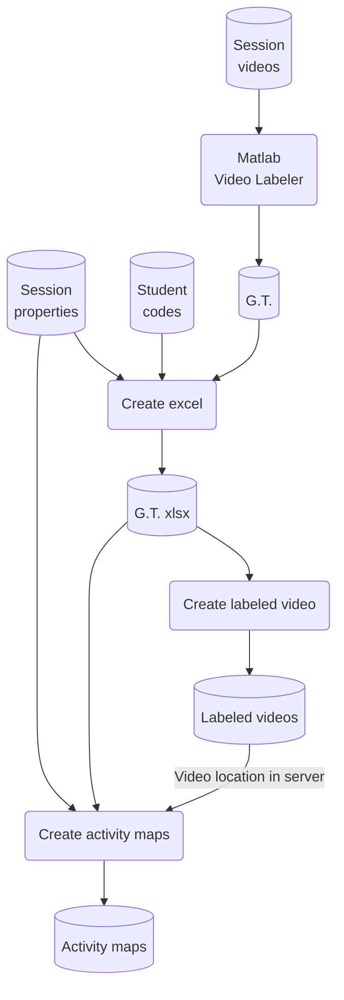
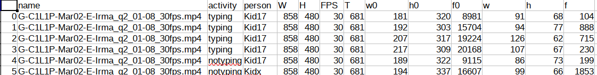
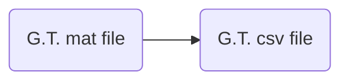
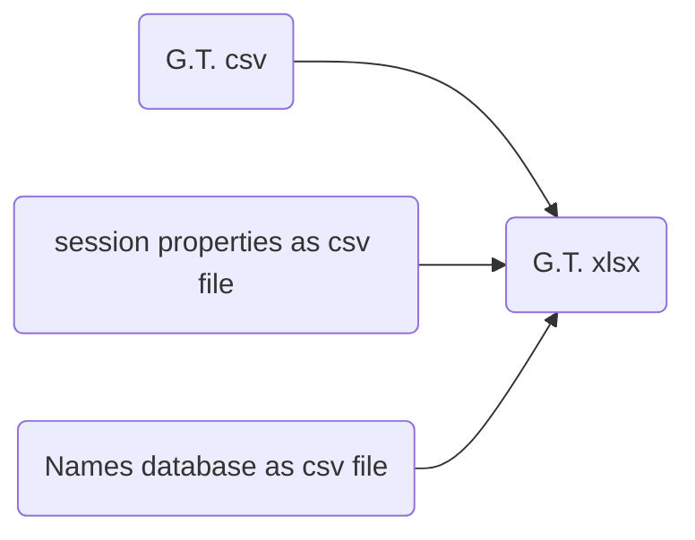
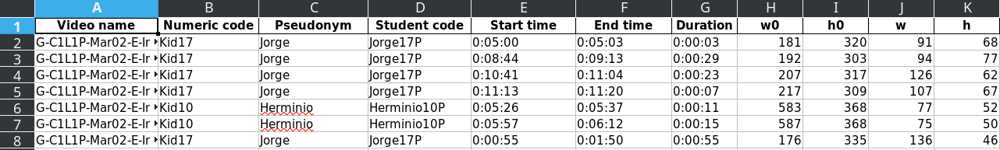

# Activity maps
<!-- markdown-toc start - Don't edit this section. Run M-x markdown-toc-refresh-toc -->
**Table of Contents**

- [Activity maps](#activity-maps)
    - [Where can I see them?](#where-can-i-see-them)
    - [How to create activity map from ground truth?](#how-to-create-activity-map-from-ground-truth)
        - [0. Overview](#0-overview)
        - [1. MATLAB ground truth](#1-matlab-ground-truth)
        - [2. Human and Machine readable xlsx sheets](#2-human-and-machine-readable-xlsx-sheets)
        - [3. Creating labeled video](#3-creating-labeled-video)
        - [4. Upload labeled video to AOLME server](#4-upload-labeled-video-to-aolme-server)
        - [5. Creating activity maps](#5-creating-activity-maps)
        - [7. Uploading them to AOLME data server](#7-uploading-them-to-aolme-data-server)
        - [8. Add it to AOLME website](#8-add-it-to-aolme-website)

<!-- markdown-toc end -->

## Where can I see them?
Please visit the following [**link**](https://aolme.unm.edu/researcher/activity_maps/typing_and_writing_maps_list.php)
to see them.


## How to create activity map from ground truth?

### 0. Overview
The following diagram provides various files and databases involved in creating
the activity map


### 1. MATLAB ground truth
MATLAB Video Labeler is used to create the ground truth. The ground truth bounding boxes are
then exported to `.csv` file using MATLAB script, `HAQ/activity-labels/gt/processing/mat_to_csv.m`.
Here is a sample csv,





### 2. Human and Machine readable xlsx sheets
The CSV file created in the above step cannot be easily understood by humans. To make it
accesable to *humans* I created an excel with two sheets,
1. Human Readable
2. Machine Readable
The Activity maps are produced by using Machine readable sheet.



```bash
# Location: HAQ/activity-labels/edu-dept/create_xlsx.py

python create_xlsx.py \
       ~/Dropbox/typing-notyping/C1L1P-E/20170302/gTruth-tynty_30fps.csv \   # Ground truth csv file
       ~/Dropbox/typing-notyping/kid-pseudonym-mapping.csv \                 # Names database
       ~/Dropbox/typing-notyping/C1L1P-E/20170302/gt-ty-30fps.xlsx \         # output excel file path
       typing \                                                              # Activity
       person \                                                              # Column name having student identification
       numeric_code                                                          # Type of student identification used
```

Human readable xlsx sheet


Machine readbel xlsx sheet


### 3. Creating labeled video
Before creating ativity map we need to create a labeled video. The script to do this is
at `HAQ/activity-videos/label_videos.py`. It takes a `JSON`configuration file as input.
The JSON file contains,
```json
{
    "ty": "/home/vj/data/Dropbox/typing-notyping/C1L1P-E/20170302/gt-ty-30fps.xlsx",
    "wr": "/home/vj/data/Dropbox/writing-nowriting-GT/C1L1P-E/20170302/gt-wr-30fps.xlsx",
    "sprops": "/home/vj/data/Dropbox/AOLME_Activity_videos/C1L1P-E/20170302/gt/properties_session.csv",
    "idir": "/home/vj/data/Dropbox/typing-notyping/C1L1P-E/20170302",
    "odir": "/home/vj/data/Dropbox/AOLME_Activity_videos/C1L1P-E/20170302/gt",
    "name_postfix": "gt"
}
```
Then label the video with,
```sh
python label_videos.py ~/Dropbox/AOLME_Activity_videos/C1L1P-E/20170302/gt/cfg.json
```

### 4. Upload labeled video to AOLME server
Upload the video to its proper directory in AOLME Data server. For example the
videos produced in the previous step should be uploaded to,

```sh
D:\iisroot\activity_maps\typing_writing\C1L1P-E\20170302
```
### 5. Creating activity maps
The configuration is given as a json file with following properties,
```json
    "ty"	    : "/home/vj/data/Dropbox/typing-notyping/C1L1P-E/20170302/gt-ty-30fps.xlsx",
    "wr"    	: "/home/vj/data/Dropbox/writing-nowriting-GT/C1L1P-E/20170302/gt-wr-30fps.xlsx",
    "sprops"	: "/home/vj/data/Dropbox/AOLME_Activity_Maps/typing_writing/C1L1P-E/20170302/properties_session.csv",
    "vloc"    	: "activity_maps/typing_writing/C1L1P-E/20170302",
    "odir"    	: "/home/vj/data/Dropbox/AOLME_Activity_Maps/typing_writing/C1L1P-E/20170302/"
```
Runt he script located at `HAQ/activity-maps/gt_act_maps/gt_map.py`
```sh
python gt_map.py ~/Dropbox/AOLME_Activity_Maps/typing_writing/C1L1P-E/20170302/cfg.json
```
It produces, in this case, three activity maps, `gt.html`, `gt_ty.html` and `gt_wr.html`.

### 7. Uploading them to AOLME data server
Copy these activity maps to the same location as the videos in setp 4.
```sh
D:\iisroot\activity_maps\typing_writing\C1L1P-E\20170302
```
### 8. Add it to AOLME website
Add a link to AOLME website at `https://aolme.unm.edu/researcher/activity_maps/typing_and_writing_maps_list.php`.
