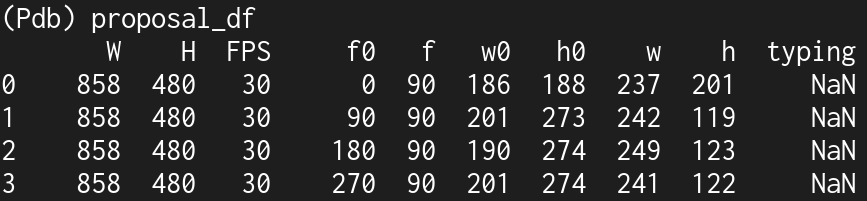

# Typing proposals
**Assumption:** There is only one keyboard and it is being shared among students. Hence to get
region where there might be potential typing we can take union over short durations.

We use keyboard detections from the previous section to propose 3 second trims that could
have typing. Since we run keyboard detection every second, we take the union
of keyboard detections in 3 second interval to propose typing regions.

The output data frame looks like this,

