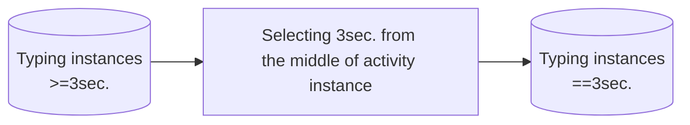

# Trimmed videos (New way)
The following file describes in detail creation of new trimmed videos to train the following activity classifiers,
1. typing vs no-typing
2. writing vs no-writing.

<!-- markdown-toc start - Don't edit this section. Run M-x markdown-toc-refresh-toc -->
**Table of Contents**

- [Trimmed videos (New way)](#trimmed-videos-new-way)
    - [Required files](#required-files)
        - [Typing](#typing)
        - [Writing](#writing)
    - [Procedure overview](#procedure-overview)
        - [Selecting 90 frames from the middle of activity instance](#selecting-90-frames-from-the-middle-of-activity-instance)
        - [Writing](#writing-1)

<!-- markdown-toc end -->

## Required files

## Procedure overview
### Selecting 90 frames from the middle of activity instance
1. From each activity select 3 seconds (90 frames) from the middle.

  - Let typing instances start at frame $f0$ and end at frame $f0 + f$.
  - The $3$ seconds or $90$ frames typing instance will start from $f0^*$ and end at frame $f0^* + 90$
  $$
  f0^* = f0 + f/2 - 45
  $$
3. In the new 3 sec activity instances 
### Writing
