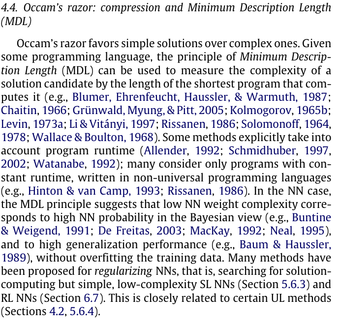

# Deep neural network concepts
<!-- markdown-toc start - Don't edit this section. Run M-x markdown-toc-refresh-toc -->
**Table of Contents**

- [Deep neural network concepts](#deep-neural-network-concepts)
    - [Glossary](#glossary)
    - [Less parametrs implies better generalizability](#less-parametrs-implies-better-generalizability)
        - [HOML](#homl)
        - [I2SL](#i2sl)
    - [General principle of parsimonious data modeling](#general-principle-of-parsimonious-data-modeling)
        - [ESLII](#eslii)
        - [The R book](#the-r-book)
        - [Deep learning in neural networks: An overview](#deep-learning-in-neural-networks-an-overview)

<!-- markdown-toc end -->

## Glossary
* **HOML:** Hands on machine learning with scikit-learn and tensorlfow (2nd edition).
* **I2SL:** An Introduction to Statistical Learning (2nd edition)
* **ESLII:** Elements of statistical learning (2nd edition)
## Less parametrs implies better generalizability
### HOML
* Chapter 1.The Machine Learning Landscape

  ```
  Overfitting happens when the model is too complex relative to the
  amount and noisiness of the training data. Here are possible solutions:
  
  1. Simplify the model by selecting one with fewer parameters
  (e.g., a linear model rather than a high-degree polynomial model),
  by reducing the number of attributes in the training data, or by
  constraining the model.
  ```
  
* Chapter 1. The Machine Learning Landscape (Exercise solutions)
  
  ```
  If a model performs great on the training data but generalizes
  poorly to new instances, the model is likely overfitting the
  training data (or we got extremely lucky on the training data).
  Possible solutions to overfitting are getting more data, simplifying
  the model (selecting a simpler algorithm, reducing the number of
  parameters or features used, or regularizing the model), or
  reducing the noise in the training data.
  ```
  
* Chapter 11. Training Deep Neural Networks
  
  ```
  A model with millions of parameters would severely risk overfitting
  the training set, especially if there are not enough training
  instances or if they are too noisy.
  ```
  
### I2SL
  
Chapter 10: Deep learning, page 433

```
When faced with new data modeling and prediction problems, its
tempting to always go for the trendy new methods. Often they give
extremely impressive results, especially when the datasets are very
large and can support the fitting of high-dimensional nonlinear
models. However, if we can produce models with the simpler tools
that perform as well, they are likely to be easier to fit and
understand, and potentially less fragile than the more complex
approaches. Wherever possible, it makes sense to try the simpler
models as well, and then make a choice based on the
performance/complexity tradeoff.
```

## General principle of parsimonious data modeling

### ESLII

* Chapter 3: Linear Methods for Regression, page 61

```
We have used the “one-standard-error” rule—we pick the most
parsimonious model within one standard error of the minimum
(Section 7.10, page 244). Such a rule acknowledges the fact that the
tradeoff curve is estimated with error, and hence takes a conservative
approach.
```

* Chapter 7: Model Assessment and Selection, page 244

```
Often a “one-standard error” rule is used with cross-validation,
in which we choose the most parsimonious model whose error is no
more than one standard error above the error of the best model.
```

### The R book

Link: [Sfari book link](https://learning.oreilly.com/library/view/the-r-book/9780470510247/ch009-sec004.html#ch009-sec004)  
Citations: 12,781

```
For statistical modelling, the principle of parsimony means that:
* models should have as few parameters as possible;
* linear models should be preferred to non-linear models;
* experiments relying on few assumptions should be preferred to those
  relying on many;
* models should be pared down until they are minimal adequate;
* simple explanations should be preferred to complex explanations.
```

### Deep learning in neural networks: An overview

Link: [ELSEVIER](https://reader.elsevier.com/reader/sd/pii/S0893608014002135?token=3E0F20868E959BD888F51FE6B78C329AC533D4BE4FBE55CF8389C83F0AD2C2D8839ACF980FAD0421F9A5268BAD4C64CD&originRegion=us-east-1&originCreation=20220126154516)  
Citations: 14,820

