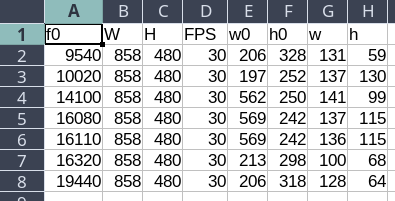

# Keyboard detection
Sravani Teeparthi worked on this problem, please refer
[Long Term Object Detection and Tracking in Collaborative Learning Environments](https://arxiv.org/abs/2106.07556)
for more details. (??? request sravani to describe something here.)

The output is a `CSV` file,

