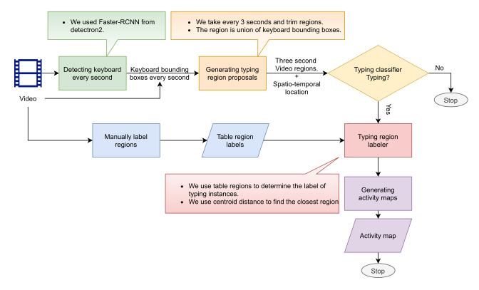
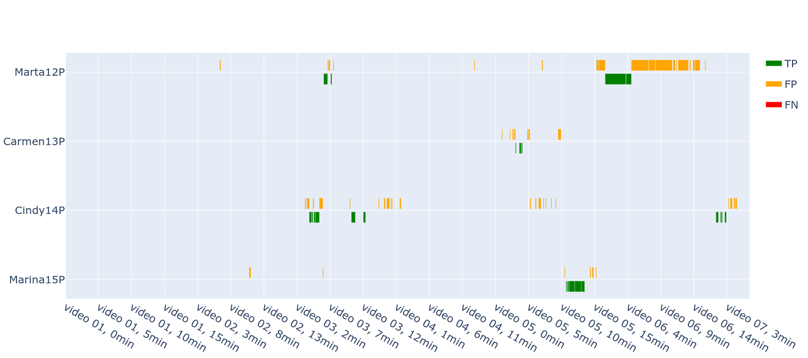

# Typing framework
<!-- markdown-toc start - Don't edit this section. Run M-x markdown-toc-refresh-toc -->
**Table of Contents**

- [Typing framework](#typing-framework)
    - [Status (updated Jan 19, 2022)](#status-updated-jan-19-2022)
        - [To improve](#to-improve)
        - [Ideas](#ideas)
    - [Overvriew](#overvriew)
        - [Assumptions](#assumptions)
        - [System diagram](#system-diagram)
    - [Results](#results)
        - [C1L1P-E, Mar 02](#c1l1p-e-mar-02)
        - [C1L1P-C, Apr 13](#c1l1p-c-apr-13)
        - [C1L1P-C, Mar 30](#c1l1p-c-mar-30)
        - [C2L1P-B, Feb 23](#c2l1p-b-feb-23)
        - [C2L1P-D, Mar 08](#c2l1p-d-mar-08)
        - [C3L1P-C, Apr 11 (DID not work!)](#c3l1p-c-apr-11-did-not-work)
        - [C3L1P-D, Feb 21 (Did not work!)](#c3l1p-d-feb-21-did-not-work)

<!-- markdown-toc end -->
## Status (updated Jan 19, 2022)
### To improve

### Ideas

## Overvriew
### Assumptions
+ **1. One keyboard:** There is one keyboard that is being shared among students.
  This assumption plays an important role in [*Typing proposals*](../activity-proposals/typing-proposals.md).
+ **2. Students do not move much:** We assume that the students do not move much once
  they are settled in. This provides us with an opportunity to label regions on the
  table extremely fast, [*Typing association*](../activity-association/activity_association.md).

### System diagram

+ [**Keyboard detection:**](../object-detection/keyboard_detection.md)
  * We used Faster-RCNN provided by detectron2 to detect keyboard.
  * We ran detection every 1 second.
  * The detections are stored in a `CSV` file.
+ [**Typing proposals:**](../activity-proposals/typing-proposals.md)
  * For every 3 second of video we propose regions where there might be typing.
  * A region is union of *keyboard detections*.
  * The output of this module is a dataframe.
+ [**Typing classifier:**](../activity-classifier/activity-classifier.md)
  * We use optimized 3D-CNNs for recognizing (classifying) typing from no-typing instances.
  * We found the best depth for our 3D-CNNs to be 4
  * We used the best saved model to recognize typing.
+ [**Typing association:**](../activity-association/activity_association.md)
  * We label typing instance with a label representing a student.
  * We do this by finding the closest region to typing instance from manually labeled table regions.
  * We use distance between centroids to identify the label of typing activity.
+ [**Results**](#results)
  * We use labeled typing regions to plot typing activity map.

## Results
Once we have typing instances with labels we can compute acitvity maps.
Please refer [activity-maps.md](../activity-maps/acitivty-maps.md) for
more details.

### C1L1P-E, Mar 02

| student_code | TP  | TN   | FP  | FN |
|--------------|-----|------|-----|----|
| Emilio25P    | 71  | 4998 | 37  | 0  |
| Juan16P      | 118 | 4677 | 311 | 0  |
| Jacinto51P   | 188 | 4743 | 175 | 0  |
| Jorge17P     | 158 | 4740 | 208 | 0  |
| Herminio10P  | 163 | 4809 | 134 | 0  |

### C1L1P-C, Apr 13

| student_code | TP  | TN   | FP  | FN |
|--------------|-----|------|-----|----|
| Marina15P    | 156 | 5955 | 93  | 0  |
| Cindy14P     | 187 | 5646 | 371 | 0  |
| Carmen13P    | 36  | 6045 | 123 | 0  |
| Marta12P     | 279 | 5184 | 741 | 0  |

### C1L1P-C, Mar 30

| student_code | TP | TN   | FP  | FN |
|--------------|----|------|-----|----|
| Marta12P     | 3  | 5766 | 3   | 0  |
| Windy        | 0  | 5736 | 36  | 0  |
| Cindy14P     | 0  | 5664 | 108 | 0  |
| Kelly        | 0  | 5766 | 6   | 0  |
| Carmen13P    | 0  | 5712 | 60  | 0  |
| Marina15P    | 27 | 5604 | 141 | 0  |

### C2L1P-B, Feb 23

| student_code | TP  | TN   | FP  | FN |
|--------------|-----|------|-----|----|
| Emily62P     | 245 | 5879 | 385 | 0  |
| Cesar61P     | 2   | 6428 | 79  | 0  |
| Mauricio60P  | 189 | 6173 | 147 | 0  |
| Cindy14P     | 9   | 6119 | 381 | 0  |
| Shelby       | 0   | 6509 | 0   | 0  |

### C2L1P-D, Mar 08

| student_code | TP  | TN   | FP   | FN |
|--------------|-----|------|------|----|
| Javier67P    | 120 | 6043 | 228  | 0  |
| Jesus69P     | 258 | 4438 | 1695 | 0  |
| Kenneth1P    | 420 | 5161 | 810  | 0  |
| Chaitu       | 0   | 6391 | 0    | 0  |

### C3L1P-C, Apr 11 (Did not work!)

### C3L1P-D, Feb 21 (Did not work!)
