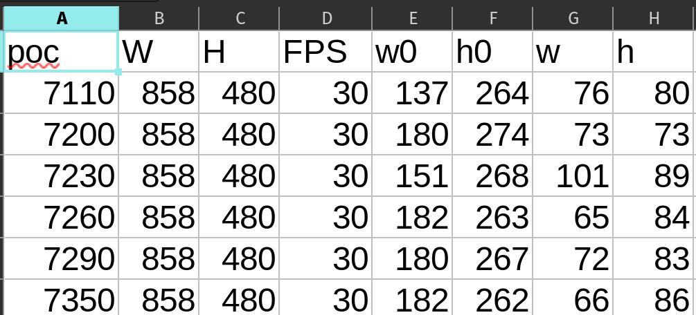
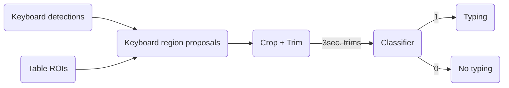

# Typing framework
```toc
```

<!-- markdown-toc start - Don't edit this section. Run M-x markdown-toc-refresh-toc -->
**Table of Contents**

- [Typing framework](#typing-framework)
    - [Prerequisites](#prerequisites)
        - [1. Keyboard detections](#1-keyboard-detections)
        - [2. Table ROI](#2-table-roi)
        - [3. typing/no-typing binary classifier](#3-typingno-typing-binary-classifier)
            - [Optimal depth](#optimal-depth)
            - [Dataset split](#dataset-split)
            - [Training/Validation](#trainingvalidation)
    - [Framework](#framework)
        - [Keyboard region proposals](#keyboard-region-proposals)
            - [Procedure](#procedure)
    - [Tasks](#tasks)
- [Footnotes](#footnotes)

<!-- markdown-toc end -->

## Prerequisites
To detect and process typing instances in a video we need the following CSV files.
1. Keyboard detections
2. Table ROI
3. Typing binary classifier

### 1. Keyboard detections
The keyboard detections are taken from [Sravani Teeparthi thesis](https://arxiv.org/abs/2106.07556)[^fn1]. The keyboard detections are
stored as CSV file. A sample is shown below,



### 2. Table ROI
Table region of interests (ROI) are manually annotated once every second. We used Matlab Video Labeler to annotate
regions. We then convert the regions to a CSV file as shown below,


In the above figure, entries, such as `266-256-140-89`, describes bounding box
coordinates for each person in the video.

### 3. typing/no-typing binary classifier
#### Optimal depth
To train our Dyadic 3D-CNN classifier we first determine the optimal depth. The process is described in [3D-CNN_optimal_depth.md](../activity-classifier/activity-classifier.md) and the optimal depth is 4.


-------------------------------------------
#### Dataset split
Using this optimal depth, 4, we train typing classifier. The training and
validation are separated based on sessions. A summary is provided below,
for more details please refer [Session bases split](../dataset/trimmed_videos_session_split.md).

**Training:**  In total we have 262 typing and 142 no-typing samples from 10 groups, 33 sessions and 35 persons.  
We make this into balanced dataset by taking **150 samples each**. The samples are taken such that they mainain data
diversity, thus having samples from all the 33 sessions from 35 persons.

```
'G-C1L1P-Apr06-A' 'G-C1L1P-Apr06-B' 'G-C1L1P-Apr06-D' 'G-C1L1P-Apr13-A'
'G-C1L1P-Apr13-D' 'G-C1L1P-Apr20-A' 'G-C1L1P-Apr20-C' 'G-C1L1P-Apr20-D'
'G-C1L1P-Apr27-B' 'G-C1L1P-Feb16-A' 'G-C1L1P-Feb16-C' 'G-C1L1P-Feb25-A'
'G-C1L1P-Feb25-C' 'G-C1L1P-Feb25-E' 'G-C1L1P-Mar02-A' 'G-C1L1P-Mar02-C'
'G-C1L1P-Mar09-A' 'G-C1L1P-Mar09-B' 'G-C1L1P-Mar09-C' 'G-C1L1P-Mar09-D'
'G-C1L1P-Mar30-B' 'G-C1L1P-May04-B' 'G-C1L1P-May06-B' 'G-C1L1P-May11-B'
'G-C1L1W-Apr25-A' 'G-C1L1W-Feb21-A' 'G-C1L1W-Feb21-C' 'G-C1L1W-Feb28-A'
'G-C1L1W-Feb28-D' 'G-C1L1W-Mar07-A' 'G-C1L1W-Mar28-A' 'G-C1L1W-May06-B'
'G-C2L1W-Apr10-A'
```

**Validation:** We use sessions that are not in Training dataset. The sessions are,

```
'G-C1L1P-Mar02-B' 'G-C1L1P-May04-C' 'G-C2L1P-Apr12-C' 'G-C2L1W-Feb27-B'
'G-C3L1W-Mar19-D'
```

These sessions have **176 typing** and **208 no-wiriting** samples.

#### Training/Validation
**Training:**
I will be using the run from my proposal.

**Validation:**
I will be using the run from my proposal.

**Best epoch:**
```sh
# From HAQ/activity-classifiers/best_model_from_logs
python exp2_print_best_epoch.py /mnt/twotb/dyadic_nn/workdir/tynty/one_trim_per_instance_3sec_224/trn_videos_142per_act/dyad_4/run0/val_videos_all_log.json

best epoch: 19
trn acc   : 0.91
val acc   : 0.85
acc diff  : 0.06
```

**Learning curves:**
To create learning curves use the script,
```sh
# Location activity-classifiers/plotting/plot_learning_curves.py

python plot_learning_curves.py \
/mnt/twotb/dyadic_nn/workdir/wnw/one_trim_per_instance_3sec_224/trn_videos_150per_act/dyad_4/run1/trn_log.json \
/mnt/twotb/dyadic_nn/workdir/wnw/one_trim_per_instance_3sec_224/trn_videos_150per_act/dyad_4/run1/val_log.json
```

- [Accuracy learning curve](./learning-curves/accuracy_trn_videos_142per_act.html)
- [Loss learning curve](./learning-curves/loss_trn_videos_142per_act.html)

## Framework

### Keyboard region proposals
#### Procedure
1. Consider table rois in intervals of 3 seconds. For each second we use the rois of first frame.
2. If we do not have more than two seconds with rois we skip to next three seconds.
3. Otherwise we calculate ROI boundary. With one corner (min(X), min(Y)) and other (max(X), max(Y).
4. Detections with 50% of area within ROI boundary are considered as **valid detections**.
5. We take union of all valid detections and create 3 second trims of the union.
6. These trimmed videos are classified to detect typing.

[^fn1]: Teeparthi, Sravani. "Long Term Object Detection and Tracking in Collaborative Learning Environments." arXiv preprint arXiv:2106.07556 (2021).
