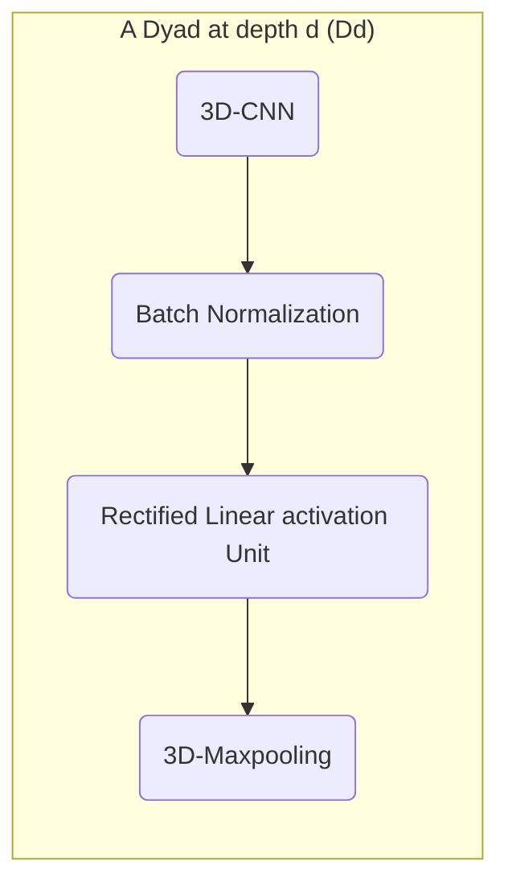
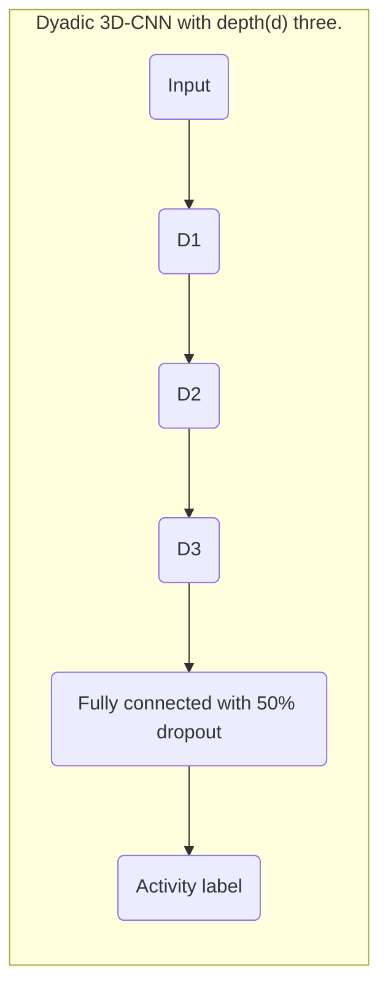

# Dyadic 3D-CNN optimal depth

<!-- markdown-toc start - Don't edit this section. Run M-x markdown-toc-refresh-toc -->
**Table of Contents**

- [Writing classification](#writing-classification)
    - [Dyadic 3D-CNN optimal depth](#dyadic-3d-cnn-optimal-depth)
        - [Results](#results)
            - [C1L1P-B](#c1l1p-b)
            - [C2L1P-C](#c2l1p-c)
            - [C2L1P-B](#c2l1p-b)
            - [C2L1P-C](#c2l1p-c-1)
        - [Inference](#inference)
    - [Training using complete training set](#training-using-complete-training-set)

<!-- markdown-toc end -->

For writing classification we use dyadic 3D-CNNs of optimal depth d*. A **dyad** is defined as below,

In this section we study the optimal depth (d*) for 3D-CNNs using [group based leave one out](../dataset/trimmed_video_group_split.md). The data-set is summarized in the table below,

| Group left | # Traning samples | # Validation samples |
|------------|-------------------|----------------------|
|            | (w, nw)           | (w, nw)              |
| C1L1P-B    | 442, 229          | 57, 75               |
| C1L1P-C    | 162, 166          | 337, 138             |
| C2L1P-B    | 482, 248          | 17, 56               |
| C2L1P-C    | 411, 269          | 88, 35               |

## Results
### C1L1P-B

- [Learning curve - plotly](./learning-curves/group-leave-one-out/wnw_C1L1P-B.html)

| Depth (d) | # param | Best epoch | Trn. Acc. | Val. Acc. | $\Delta$ (Trn - Val) |
|-----------|---------|------------|-----------|-----------|----------------------|
| 2         | 47,305  | 20         | 98        | 81        | 16                   |
| 3         | 7,801   | 2          | 83        | 77        | 6                    |
| 4         | 18,777  | 13         | 90        | 83        | 7                    |

### C2L1P-C

- [Learning curve - plotly](./learning-curves/group-leave-one-out/wnw_C1L1P-C.html)

| Depth (d) | # param | Best epoch | Trn. Acc. | Val. Acc. | $\Delta$ (Trn - Val) |
|-----------|---------|------------|-----------|-----------|----------------------|
| 2         | 47,305  | 0          | 51        | 71        | -20                  |
| 3         | 7,801   | 9          | 90        | 82        | 8                    |
| 4         | 18,777  | 19         | 90        | 87        | 3                    |

### C2L1P-B

- [Learning curve - plotly](./learning-curves/group-leave-one-out/wnw_C2L1P-B.html)

| Depth (d) | # param | Best epoch | Trn. Acc. | Val. Acc. | $\Delta$ (Trn - Val) |
|-----------|---------|------------|-----------|-----------|----------------------|
| 2         | 47,305  | 0          | 79        | 75        | 4                    |
| 3         | 7,801   | 7          | 91        | 77        | 14                   |
| 4         | 18,777  | 23         | 92        | 75        | 17                   |

### C2L1P-C

- [Learning curve - plotly](./learning-curves/group-leave-one-out/wnw_C2L1P-C.html)

| Depth (d) | # param | Best epoch | Trn. Acc. | Val. Acc. | $\Delta$ (Trn - Val) |
|-----------|---------|------------|-----------|-----------|----------------------|
| 2         | 47,305  | 3          | 86        | 85        | 1                    |
| 3         | 7,801   | 17         | 95        | 86        | 8                    |
| 4         | 18,777  | 36         | 96        | 89        | 7                    |

## Inference
The winning architectures is the one having highest validation accuracy. They are
summarized below for leave one group out,

| Group (left out) | Winning depth | Val. Acc. |
|------------------|---------------|-----------|
| C1L1P-B          | 4             | 83        |
| C1L1P-C          | 4             | 87        |
| C2L1P-B          | 3             | 77        |
| C2L1P-C          | 4             | 89        |

Form the above table we can see that dyadic 3D-CNN with depth 4 performed the best
in 3 out of 4 cases. Hence we choose this architecture as the winner.
