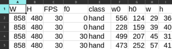
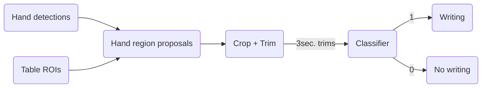
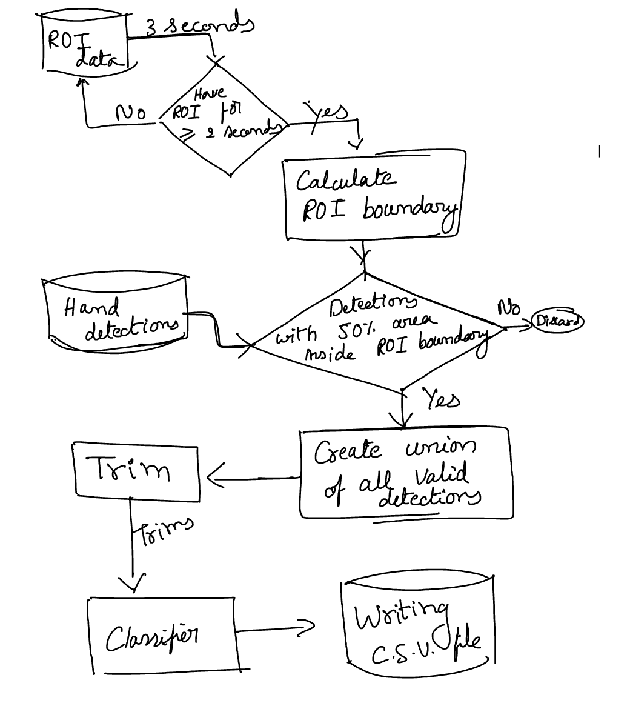

# Writing framework
```toc
```

<!-- markdown-toc start - Don't edit this section. Run M-x markdown-toc-refresh-toc -->
**Table of Contents**

- [Writing framework](#writing-framework)
    - [Prerequisites](#prerequisites)
        - [1. Hand detections](#1-hand-detections)
        - [2. Table ROI](#2-table-roi)
        - [3. writing/no-writing binary classifier](#3-writingno-writing-binary-classifier)
            - [Optimal depth](#optimal-depth)
            - [Dataset split](#dataset-split)
            - [Training/Validation](#trainingvalidation)
    - [Framework](#framework)
        - [Hand region proposals](#hand-region-proposals)
            - [Procedure](#procedure)
    - [Tasks](#tasks)
- [Footnotes](#footnotes)

<!-- markdown-toc end -->

## Prerequisites
To detect and process writing instances in a video we need the following CSV files.
1. Hand detections
2. Table ROI
3. Writing binary classifier

### 1. Hand detections
The hand detections are taken from [Sravani Teeparthi thesis](https://arxiv.org/abs/2106.07556)[^fn1]. The hand detections are
stored as CSV file. A sample is shown below,



### 2. Table ROI
Table region of interests (ROI) are manually annotated once every second. We used Matlab Video Labeler to annotate
regions. We then convert the regions to a CSV file as shown below,


In the above figure, entries, such as `266-256-140-89`, describes bounding box
coordinates for each person in the video.

### 3. writing/no-writing binary classifier
#### Optimal depth
To train our Dyadic 3D-CNN classifier we first determine the optimal
depth. The process is described in [3D-CNN_optimal_depth.md](./3D-CNN_optimal_depth.md)
and the optimal depth is 4.

#### Dataset split
Using this optimal depth, 4, we train writing classifier. The training and
validation are separated based on sessions. A summary is provided below,
for more details please refer [Session bases split](../dataset/trimmed_videos_session_split.md).

**Training:**  In total we have 792 writing and 193 no writing samples from 7 groups, 22 sessions and 32 persons.  
We make this into balanced dataset by taking **150 samples each**. The samples are taken such that they mainain data
diversity, thus having samples from all the 22 sessions from 32 persons.

```
'G-C1L1P-Apr06-C' 'G-C1L1P-Apr06-D' 'G-C1L1P-Apr13-D' 'G-C1L1P-Apr20-C'
'G-C1L1P-Apr20-D' 'G-C1L1P-Feb16-C' 'G-C1L1P-Feb25-C' 'G-C1L1P-Mar02-D'
'G-C1L1P-Mar09-C' 'G-C1L1P-Mar09-D' 'G-C1L1P-Mar30-C' 'G-C1L1P-Mar30-D'
'G-C1L1P-May11-C' 'G-C1L1W-Apr04-A' 'G-C1L1W-Feb14-A' 'G-C1L1W-Feb21-A'
'G-C1L1W-Feb28-A' 'G-C2L1P-Feb23-B' 'G-C2L1W-Apr10-A' 'G-C2L1W-Feb20-A'
'G-C2L1W-Feb27-B' 'G-C3L1P-Feb14-D'	
```

**Validation:** We use sessions that are not in Training dataset. The sessions are,

```
'G-C1L1P-Mar02-B' 'G-C1L1P-May04-C' 'G-C2L1P-Apr12-C' 'G-C3L1W-Mar19-D'
```

These sessions have **181 writing** and **116 no-wiriting** samples.

#### Training/Validation
**Training:**

```sh
# From /home/vj/data_500gb/Dropbox/Marios_Shared/HAQ-AOLME/software/HAQ/activity-classifiers/training
CUDA_VISIBLE_DEVICES=1 python train_dyadic_cnn3d.py \
/mnt/twotb/aolme_datasets/wnw/trimmed_videos/one_trim_per_instance_3sec_224 \
4 \
/mnt/twotb/aolme_datasets/wnw/trimmed_videos/one_trim_per_instance_3sec_224/trn_videos_150per_act.txt \
/mnt/twotb/dyadic_nn/workdir/wnw/one_trim_per_instance_3sec_224/trn_videos_150per_act/dyad_4/run1
```

**Validation:**

```sh
# From /home/vj/data_500gb/Dropbox/Marios_Shared/HAQ-AOLME/software/HAQ/activity-classifiers/validation
CUDA_VISIBLE_DEVICES=1 python validate_dyadic_cnn3d.py \
/mnt/twotb/aolme_datasets/wnw/trimmed_videos/one_trim_per_instance_3sec_224 \
4 \
/mnt/twotb/dyadic_nn/workdir/wnw/one_trim_per_instance_3sec_224/trn_videos_150per_act/dyad_4/run1 \
/mnt/twotb/aolme_datasets/wnw/trimmed_videos/one_trim_per_instance_3sec_224/val_videos_all.txt \
val_log.json
```

**Best epoch:**
```sh
# From HAQ/activity-classifiers/best_model_from_logs

python exp2_print_best_epoch.py /mnt/twotb/dyadic_nn/workdir/wnw/one_trim_per_instance_3sec_224/trn_videos_150per_act/dyad_4/run1/val_log.json

best epoch: 7
trn acc   : 0.88
val acc   : 0.82
acc diff  : 0.06000000000000005
```

**Learning curves:**
To create learning curves use the script,
```sh
# Location activity-classifiers/plotting/plot_learning_curves.py

python plot_learning_curves.py \
/mnt/twotb/dyadic_nn/workdir/wnw/one_trim_per_instance_3sec_224/trn_videos_150per_act/dyad_4/run1/trn_log.json \
/mnt/twotb/dyadic_nn/workdir/wnw/one_trim_per_instance_3sec_224/trn_videos_150per_act/dyad_4/run1/val_log.json
```

- [Accuracy learning curve](./learning-curves/Train_150_Val_all_accuracy.html)
- [Loss learning curve](./learning-curves/Train_150_Val_all_loss.html)

## Framework

### Hand region proposals
#### Procedure
1. Consider table rois in intervals of 3 seconds. For each second we use the rois of first frame.
2. If we do not have more than two seconds with rois we skip to next three seconds.
3. Otherwise we calculate ROI boundary. With one corner (min(X), min(Y)) and other (max(X), max(Y).
4. Detections with 50% of area within ROI boundary are considered as **valid detections**.
5. We take union of all valid detections and create 3 second trims of the union.
6. These trimmed videos are classified to detect writing.



## Tasks
- [ ] Table ROI in Typing detection. Copy from writing detection
- [ ] `classify_writing_propsals` function in `framework.py` for writing should be redone to evaluate multiple proposals at a time.
 


[^fn1]: Teeparthi, Sravani. "Long Term Object Detection and Tracking in Collaborative Learning Environments." arXiv preprint arXiv:2106.07556 (2021).
